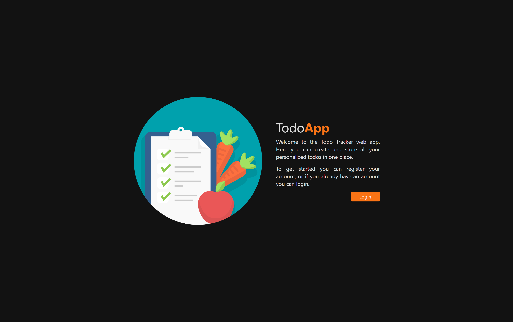
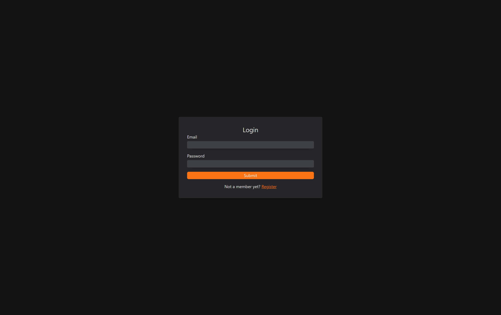
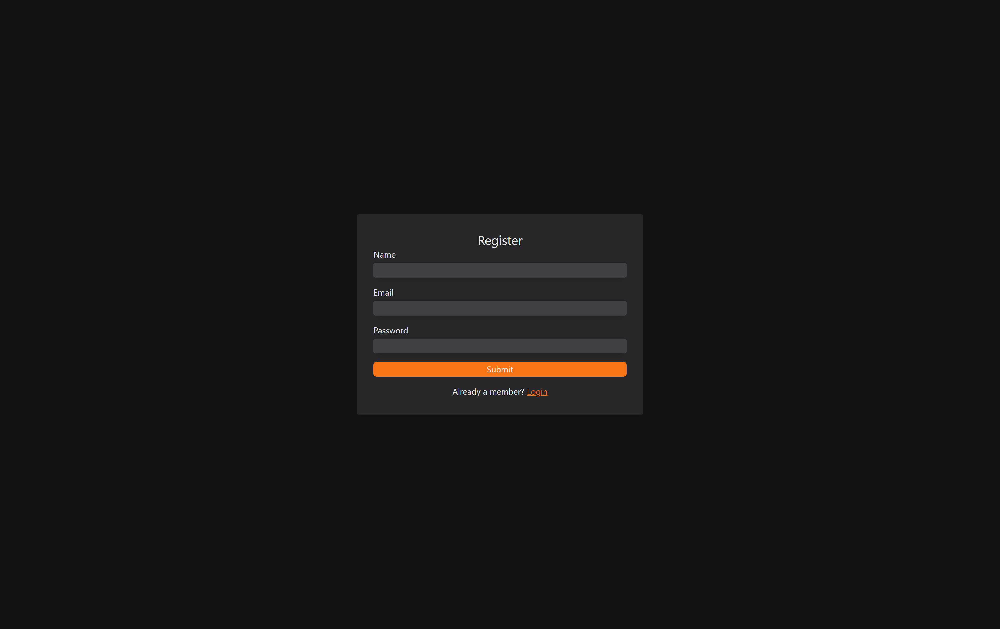
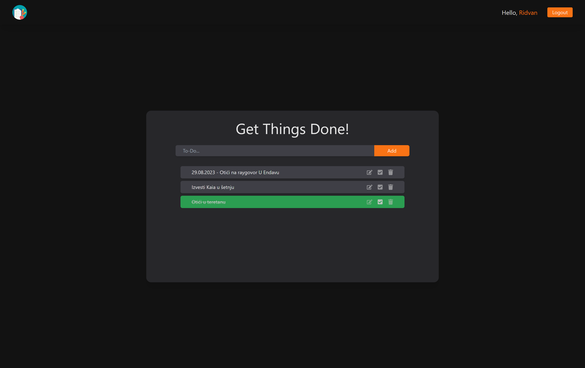
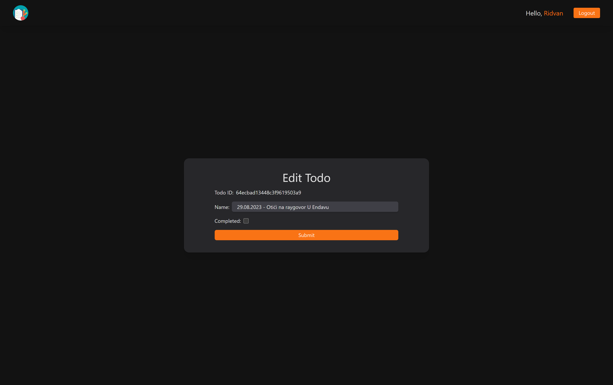

# Todo Tracker Web App

This project is a web application developed using ReactJS, Vite, NodeJS, and MongoDB. The Todo Tracker Web App allows users to manage their tasks effectively by providing a user-friendly interface to perform CRUD (Create, Read, Update, Delete) operations on todos.

## Features

<b> Create: </b>
Users can easily create new todos by entering the task details and pressing the add button.  
<b> Read: </b>
The web app provides a clear overview of all the todos, including their title, description, and due date.  
<b> Update: </b>
Users can edit any existing todo by clicking on the edit button, modifying the necessary information, and saving the changes.  
<b> Delete:</b>
When a todo is no longer needed, users can remove it from the list by clicking on the delete button.  

## Technologies Used

<b> ReactJS:</b> A popular JavaScript library for building user interfaces. It provides a component-based architecture and allows for efficient rendering of dynamic UI elements.  
<b> Vite:</b> A fast build tool for modern web applications. Vite offers quick development server startup and instant hot module replacement, optimizing the development experience.  
<b> NodeJS:</b> A JavaScript runtime built on Chrome's V8 JavaScript engine. It enables server-side scripting and allows for building scalable network applications.  
<b> MongoDB:</b> A NoSQL database system that stores data in a flexible, JSON-like format called BSON. It provides high scalability, performance, and flexibility for managing structured and unstructured data.  

## Future Enhancements

#### There are several possible improvements for the Todo Tracker Web App:

<s><b>User authentication:</b> Implement user registration and login functionality to allow users to have personalized todo lists. </s>  
<b>Filter and sorting options:</b> Enable users to filter and sort their todos based on criteria such as due date, priority, or completion status.  
<b>Reminders and notifications:</b> Integrate a notification system to remind users of upcoming deadlines or tasks that require immediate attention.  
<b>Collaboration features:</b> Implement features to allow users to share and collaborate on tasks with others, enabling teamwork and coordination.  

